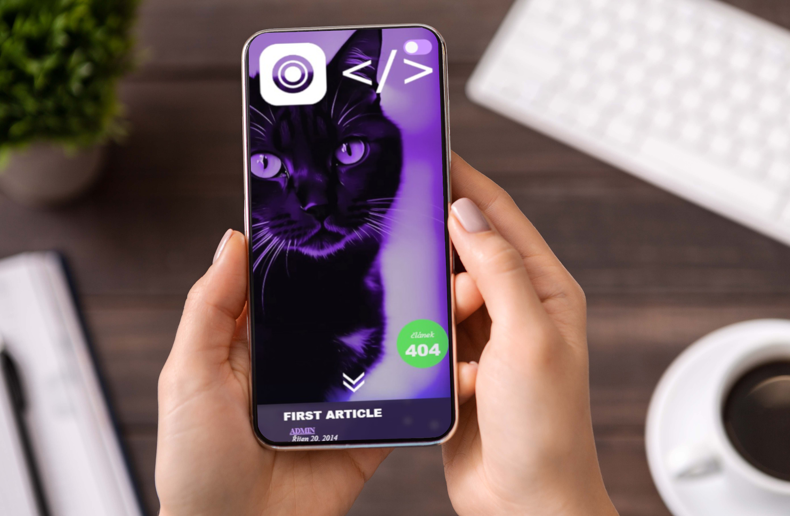

 # 📰 Blog-design – retro blogový layout s moderními úpravami
 

Tento webový projekt vznikl na základě staršího tutoriálu, který používal tehdejší běžné techniky jako **floaty** a klasické HTML rozvržení. Při jeho úpravě jsem přidala vlastní prvky a styly – výsledkem je blog s retro vzhledem kombinovaný s moderním přístupem a efekty.

---

## ✨ Co projekt nabízí

- **Původní layout s využitím floatů** – pro pochopení starších metod
- **Modernizace pomocí Flexboxu** – doplnění flexibilního rozvržení
- **Světlý a tmavý režim** – včetně výměny obrázku na pozadí
- **Vlastní CSS efekty** – např. image reflection, přechody, hover efekty
- **Responzivní úpravy** pro menší zařízení
- **Zachování stylu klasického blogového rozvržení** s nadpisy, kartami a sidebar prvky

---

## 🧰 Použité technologie

- HTML5
- SCSS (vlastní proměnné, media queries, motivy)
- Floaty a Flexbox (kombinace starších a moderních přístupů)
- Google Fonts
- CSS efekty (image reflection, přechody, filtry)

---

## 🧪 Co jsem se naučila

- Jak fungovaly dřívější layouty pomocí `float` a `clear`
- Jak modernizovat starý kód bez kompletního přepisování
- Použití a optimalizaci videa v pozadí headeru
- Jak implementovat přepínač světlého/tmavého režimu s výměnou obrázku
- Jak kombinovat retro design s moderními CSS vlastnostmi
- Jak pracovat s CSS efekty pro vizuálně zajímavější zobrazení

---

## 📸 Náhled

---

## 🔗 Odkazy

- 🗂️ [Zdrojový kód](https://github.com/Alena0490/Blog-design)

---

Projekt slouží jako ukázka propojení starších webových technik s novými – ideální pro pochopení vývoje webdesignu a CSS postupů v čase.

